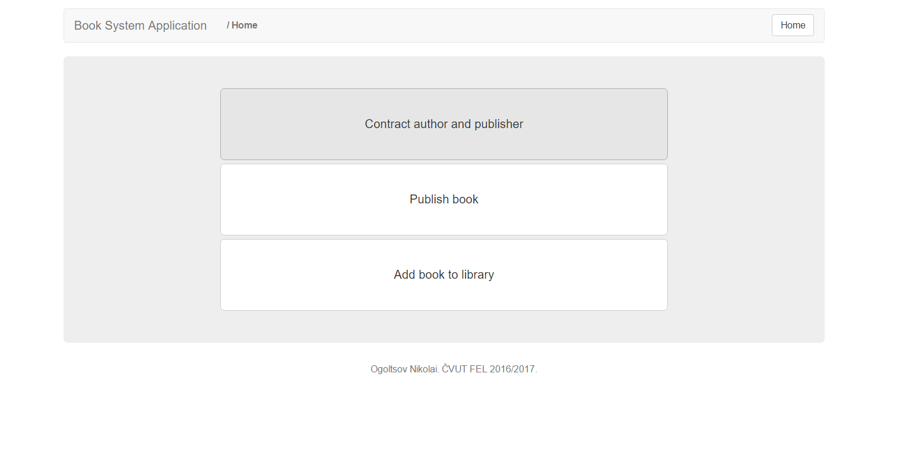
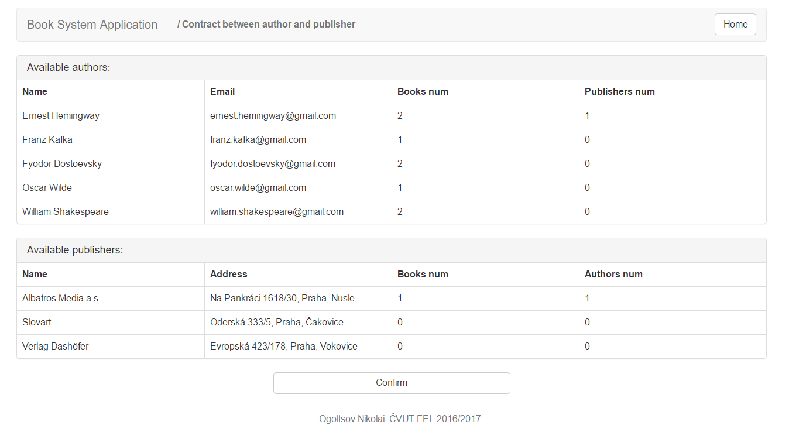
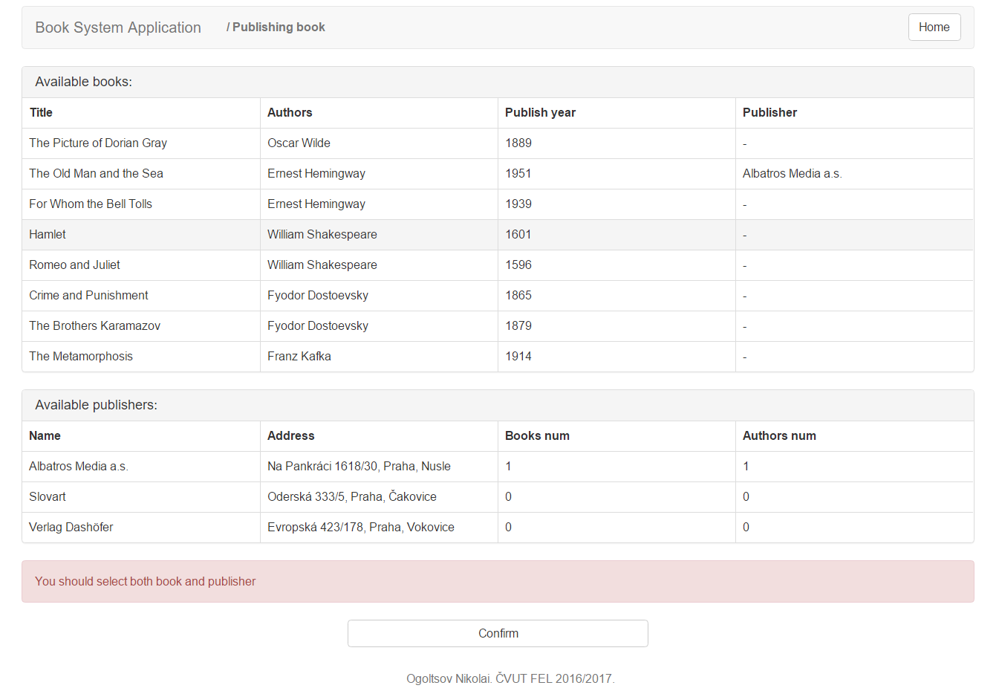
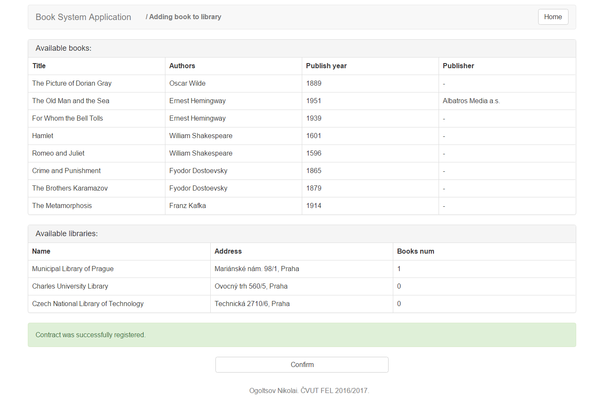

# BookSystem

###Wildfly
To deploy application to Wildfly AS: (`mvn clean package wildfly:deploy`).

###Screenshots
How it's expected to looks like in all modern browsers:

| Title                    | Image                                                           |
| ------------------------ |:---------------------------------------------------------------:|
| Home page                |           |
| Contract page            |   |
| Book publishing page     | |
| Add book to library page |    |